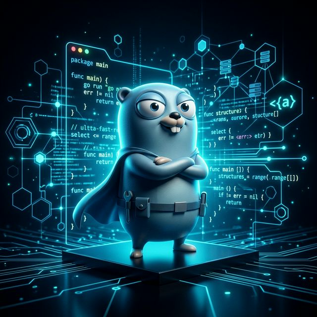

# 🚀 BTK Akademi - Go (Golang) Dili Kursu: Modern Mühendislik Yolculuğu



[](https://github.com/arch-yunus/btk_go/actions/workflows/go.yml)

Merhaba değerli geliştirici dostum! Bu depo, Türkiye'nin dijital dönüşüm hamlesinin en önemli taşlarından biri olan [BTK Akademi](https://www.btkakademi.gov.tr/portal/course/go-ile-programlamaya-giris-12760) platformu üzerinden başarıyla tamamladığım **"Go ile Programlamaya Giriş"** kursu kapsamında ilmek ilmek işlediğim projeleri, deneysel çalışmaları ve yapısal örnekleri barındıran kapsamlı bir dijital kütüphanedir. "Go neymiş ya?" diye merak ediyorsan, doğru yerdesin. Bu repo; sadeliğin gücünü, hızın zarafetini ve modern sistem programlamanın en sah halini keşfetmek isteyenler için bir başucu kaynağı niteliği taşır.

Bu çalışma; sadece sözdizimi (syntax) öğrenmenin ötesine geçerek, bir dilin felsefesini kavramayı, bellek yönetimini optimize etmeyi ve yüksek performanslı sistemler inşa etmeyi hedefleyen bir disiplinin ürünüdür. İster Go diline yeni başlayan bir meraklı ol, ister "Ben ne yazsam da kendimi geliştirsem?" diyen bir profesyonel; buradaki her satır kod, bir problem-çözüm döngüsünün ve pedagojik bir yaklaşımın sonucudur. Kodları incele, değiştir, boz ve yeniden inşa et; zira gerçek öğrenme ancak "terminalin başında ter dökerek" gerçekleşir.

---

## 🔍 Go (Golang) Nedir? Evrimsel Bir Bakış

Go (yaygın adıyla **Golang**), 2007 yılında teknoloji devi Google'ın mühendislik çekirdeğinde; Robert Griesemer, Rob Pike ve Ken Thompson (C ve Unix'in yaratıcılarından) gibi efsanevi isimlerin elinde doğdu. Bu dil, yazılım dünyasının en kronik ve can sıkıcı şikayetlerini (uzun derleme süreleri, karmaşık bağımlılık yönetimleri ve yetersiz eş zamanlılık desteği) kökünden çözmek amacıyla tasarlandı. 2009'da açık kaynak dünyasına kapılarını açan Go, 2012'de 1.0 sürümüyle olgunluğa erişti ve modern bulut bilişimin (Cloud Native) fiili standart dili haline geldi.

### Neden Go? Modern Yazılımın İsviçre Çakısı:

* 🚀 **Işık Hızında Derleme & Çalıştırma**: Go, doğrudan makine koduna (binary) derlenir. Python gibi yorumlanmaz (interpret) veya Java gibi bir sanal makineye (JVM) ihtiyaç duymaz. Bu da milisaniyeler içinde başlayan ve çalışan uygulamalar demektir.
* 🔄 **Native Concurrency (Eşzamanlılık)**: Go'nun kalbinde yatan **Goroutine** ve **Channel** mekanizmaları, milyonlarca işlemi aynı anda, çok düşük bellek maliyetiyle yönetmenize imkan tanır. İşletim sistemi thread'lerinden binlerce kat daha hafiftir.
* 🧼 **Minimalist ve Pragmatik Sözdizimi**: Go, "Az iyidir" (Less is more) felsefesini savunur. Sadece 25 anahtar kelimeyle dünyaları inşa etmenizi sağlar. Tıpkı bir IKEA mobilyası gibi: Az parça, anlaşılır kılavuz ve maksimum işlevsellik.
* 🛠 **Endüstriyel Toolchain**: `go fmt` ile kodunuzu otomatik formatlayın, `go test` ile test edin, `go doc` ile dokümantasyonunuzu oluşturun. Her şey "pil dahil" (batteries included) mantığıyla kutudan çıkar çıkmaz hazırdır.
* ⚙️ **Altyapının Omurgası**: Docker, Kubernetes, Terraform, Prometheus ve Twitch gibi devasa altyapıların arkasındaki itici güç Go'dur. Geleceğin interneti Go üzerinde yükseliyor.

---

## 🎯 Vizyon ve Misyon: Kodda Mükemmeliyet Arayışı

Bu depo sadece bir kod koleksiyonu veya bir kursun ödevi değil, aynı zamanda bir **modern mühendislik manifestosu** olma vizyonunu taşır. Eğitim ve geliştirme sürecimizde şu üç temel direğe odaklanıyoruz:

- **🔍 Mühendislik Şeffaflığı**: Kodun sadece "ne" yaptığını değil, "nasıl" ve "neden" yaptığını en derin detayına kadar göstermek. Her `main.go` dosyası bir öğretmendir.
- **🛠 Fonksiyonel Pratiklik**: Teorik bilgiyi (abstraction), doğrudan üretim ortamında (production) çalışabilecek dayanıklı kod bloklarına dönüştürmek.
- **📈 Sürdürülebilir Gelişim**: Her yeni modülde, bir önceki öğrenilen tekniği bir üst seviyeye taşıyarak; değişkenlerden eşzamanlı servislere uzanan doğrusal ve sağlam bir gelişim yolu izlemek.

---

## 🏗️ Gelişmiş Mimari Analizi: Katmanlı Öğrenme Modeli

Projelerimiz, yazılım mühendisliğinin temel prensiplerine sadık kalarak, birbirini besleyen dört ana katman üzerinde yükselmektedir. Bu hiyerarşik yapı, karmaşık sistemlerin nasıl atomik parçalardan oluştuğunu anlamamızı sağlar:

1.  **Fundamental Layer (Temel Katman)**: Değişken deklarasyonları, statik veri tipleri ve Go'nun kendine has sözdizimi kurallarının temellerinin atıldığı katmandır.
2.  **Logic Layer (Mantıksal Katman)**: Algoritmik düşüncenin vücut bulduğu; if-else blokları, switch-case yapıları ve verimli döngü yönetimiyle kontrol akışının sağlandığı katmandır.
3.  **Data & Object Layer (Veri ve Nesne Katmanı)**: Struct'lar, method'lar ve interface'ler aracılığıyla nesne yönelimli benzeri (composition-based) modellemelerin yapıldığı, verinin optimize edildiği katmandır.
4.  **Concurrency & Distributed Layer (Eşzamanlılık ve Dağıtık Mimari)**: Go'nun asıl gücü olan asenkron işlemlerin, kanal yönetiminin ve modern ağ (network) bileşenlerinin inşa edildiği "ustalık" katmanıdır.

---

## � Proje Klasörleri ve Pedagojik Yapı

Her klasör, belirli bir mühendislik problemini çözmek veya bir dil özelliğini ustalıkla kullanmak üzere tasarlanmıştır. Bu dizin ağacı, Go öğrenim yolculuğunuzun yol haritasıdır:

```bash
.
├── 01-Temel-Kavramlar/         # Hafızada değişken yönetimi, pointer başlangıçları
├── 02-Kosullar-Donguler/       # Algoritmik karar mekanizmaları ve verimli iterasyon
├── 03-Fonksiyonlar/            # Modüler kod tasarımı, parametre transferleri
├── 04-Veri-Yapilari/           # Dynamic arrays (slices), key-value yönetimi (maps)
├── 05-Struct-Interface/        # Veri modelleme ve polimorfizm (arayüz tabanlı tasarım)
├── 06-GoRoutines-Channels/     # Paralel işlem dünyasına giriş, senkronizasyon sanatı
├── 07-Web-Uygulamalari/        # HTTP protokolü, RESTful API tasarımı ve sunucu mimarisi
├── 08-testing-fundamentals/    # Unit & Benchmark testleri, TDD yaklaşımı
└── README.md                   # Projenin merkezi bilgi ve vizyon deposu
```

Buradaki projeler sadece "çalışan kodlar" değil, aynı zamanda hata yapmanın serbest olduğu, sınırların zorlandığı laboratuvar ortamlarıdır.

---

## 🧠 Öne Çıkan Teknik Konular ve Uygulamalar

### ✅ Nesne Modelleme ve Veri Yapıları (Struct & Maps)
Go'da nesne yönelimli programlama, karmaşık class hiyerarşileri yerine **composition** ve **struct** yapıları üzerine kuruludur. Bu, kodun daha esnek ve okunabilir olmasını sağlar.

```go
// Person, bir bireyi temsil eden veri modelidir.
type Person struct {
    Name string
    Age  int
}

// Map kullanarak hızlı veri erişimi sağlama:
var ages = map[string]int{"Ali": 25, "Veli": 30}
```

### ✅ Polimorfizm ve Arayüzler (Interfaces)
Arayüzler, Go'nun en güçlü silahlarından biridir. "Ne olduğu" ile değil, "ne yapabildiği" ile ilgilenir. Bu prensip (Duck Typing), modülerliği maksimize eder.

```go
func Topla(a int, b int) int {
    return a + b
}

// Hayvan arayüzü, SesCikar yeteneğine sahip her türü kapsar.
type Hayvan interface {
    SesCikar() string
}
```

### ✅ Eşzamanlılık ve İletişim (Goroutines & Channels)
Go'nun mottosu: "Hafıza paylaşarak iletişim kurma, iletişim kurarak hafıza paylaş!" (Don't communicate by sharing memory; share memory by communicating).

```go
go yazdir("Merhaba Asenkron Dünya") // Hafif siklet thread (Goroutine)

ch := make(chan string) // Veri transfer tüneli (Channel)
ch <- "veri transferi başlatıldı"
msg := <-ch
```

### ✅ Modern Web Mimarisi (HTTP Server)
Go'nun standart kütüphanesi o kadar güçlüdür ki, herhangi bir framework (Gin, Echo vb.) kullanmadan bile yüksek performanslı microservice'ler yazabilirsiniz.

```go
package main

import (
	"fmt"
	"net/http"
)

func home(w http.ResponseWriter, r *http.Request) {
	fmt.Fprintln(w, "BTK Go Sunucusuna Hoş Geldiniz!")
}

func main() {
	http.HandleFunc("/", home)
	// 8080 portunda dinlemeye hazırız
	http.ListenAndServe(":8080", nil)
}
```

Tarayıcınızı açıp `http://localhost:8080` adresine gittiğinizde, Go'nun mikrosaniyelik yanıt hızını bizzat deneyimleyeceksiniz.

### ✅ Go'da Hata Yönetimi: "Errors are Values" Felsefesi
Go, *try-catch* blokları yerine hataları normal birer geri dönüş değeri olarak ele alır. Bu felsefe, hatayı bir istisna (exception) olmaktan çıkarıp kontrol edilebilir, kodun içine yedirilmiş organik bir süreç haline getirir. Ayrıca `defer`, `panic` ve `recover` mekanizmalarıyla beklenmedik çöküşleri (runtime panics) yönetmemizi sağlar.

```go
func DosyaOkuma(dosyaAdi string) ([]byte, error) {
	veri, err := os.ReadFile(dosyaAdi)
	if err != nil {
		// Hata gizlenmez, açıkça geri döndürülerek çağırıcı uyarılır
		return nil, fmt.Errorf("kritik: dosya okunamadı -> %w", err)
	}
	return veri, nil
}
```

### ✅ Modül ve Bağımlılık Yönetimi (Go Modules)
Go 1.11 ile standartlaşan **Go Modules**, projelerin harici kütüphanelerini merkezi, şeffaf ve versiyon kontrollü bir şekilde yönetmesini sağlar. `go mod init` ile başlayan bu süreç, projenizin kalbine bir `go.mod` dosyası yerleştirerek eski nesil `GOPATH` karmaşasını ortadan kaldırır. `go get github.com/gin-gonic/gin` gibi komutlarla dünyadaki herhangi bir paket anında projenize dahil edilirken, versiyon bütünlüğü `go.sum` ile kriptografik olarak güvence altına alınır.

### ✅ Endüstri Standardı Proje Hiyerarşisi (Project Layout)
Modern ve "Enterprise" ölçekli bir Go projesinde kodlar rastgele dizinlere atılmaz. "Standard Go Project Layout" organizasyon desenine göre mimari şekillenir:
- **`cmd/`**: Uygulamanın giriş noktaları (entry points) ve çalıştırılabilir bileşenleri bulundurur. (örn: `cmd/server/main.go`).
- **`internal/`**: Dış dünyadan (diğer depolardan) import edilmesi yasak olan, sadece projenin kendi bileşenlerine özel gizli iş mantıklarının (business logic) yazıldığı alandır. Güvenlik duvarıdır.
- **`pkg/`**: Başka projelerin de güvenle import edip kullanabileceği, evrensel ve genel geçer açık kaynak yardımcı kod veya kütüphane dosyalarıdır.
- **`api/`**: OpenAPI, Swagger sözleşmeleri, gRPC/Protobuf (.proto) tanımlamalarını içerir.

### ✅ Test ve Kalite Güvencesi (Testing & Benchmarks)
Go dilinde "TDD" (Test-Driven Development) yapmak için harici obez kütüphanelere (örn: Jest, JUnit) bağımlı değilsinizdir. Her kod dosyasının (örn: `math.go`) yanına bir `math_test.go` oluşturarak `testing` kütüphanesiyle kalite hedeflerinize ulaşırsınız. Ayrıca mikrosaniyelik performans ölçümleri için built-in benchmark yeteneği devasa bir şanstır.

```go
package mymath

import "testing"

func TestTopla(t *testing.T) {
	sonuc := Topla(2, 3)
	if sonuc != 5 {
		t.Errorf("HATA: Beklenen 5, alınan %d", sonuc)
	}
}

// CPU bazlı mikro-performans (Benchmark) ölçümü
func BenchmarkTopla(b *testing.B) {
	for i := 0; i < b.N; i++ {
		Topla(100, 200)
	}
}
```
Terminalden girilecek tek bir `go test -v -cover ./...` komutuyla tüm test kapsama (coverage) oranınızı saniyeler içinde kanıtlarsınız.

---

## 🛠 Kurulum ve Geliştirme Ortamı

Projenin bir kopyasını yerel makinenizde çalıştırmak ve deneysel eklemeler yapmak için şu adımları izleyebilirsiniz:

1.  **Go Runtime Edinimi**: [Go resmi indirme sayfasından](https://go.dev/dl/) işletim sisteminize (Windows, macOS, Linux) uygun paketi kurun.
2.  **Repoyu Klonlama**: Terminalinizi açın ve `git clone` komutuyla projeyi indirin.
3.  **Çalıştırma ve Deneyimleme**:
    Herhangi bir alt klasöre girin ve Go derleyicisinin gücünü test edin:

    ```bash
    cd 01-Temel-Kavramlar/
    go run main.go
    ```

Go'nun mottosu olan *"Simple, Reliable, Efficient"* (Basit, Güvenilir, Verimli) prensibini her komutta hissedeceksiniz. Kurulum esnasında bir sorun yaşarsanız, Go'nun dokümantasyonu dünyadaki en temiz kaynaklardan biridir.

---

## ⚔️ Go vs Diğer Diller: Neden Go Tercih Ediyoruz?

Go'nun teknoloji dünyasında yarattığı devasayı sarsıntıyı anlamak için, onu rakip dillerle kıyaslamak şarttır. Go, sadece bir programlama dili değil, aynı zamanda mühendislik problemlerine karşı alınmış **radikal bir duruştur**:

- ⚡ **Go vs. Python:** Python harika bir prototipleme dilidir ancak yorumlanan (interpreted) bir dil olduğu için hız ve eşzamanlılık konusunda üretim ortamında (production) ciddi darboğazlar yaşatır (Global Interpreter Lock problemi). Go ise makine koduna doğrudan derlenen yapısı sayesinde Python'dan aritmetik olarak ortalama **40 kat daha hızlıdır** ve doğuştan (native) eşzamanlı çalışacak şekilde tasarlanmıştır. Sunucu verimini sömürmez. 
- ☕ **Go vs. Java:** Java'nın hantal "JVM" mimarisi, devasa bellek tüketimi (memory footprint) ve bitmek bilmeyen *Garbage Collection* duraklamaları ünlüdür. Go ise yalındır; mikrosaniyeler içinde (cold start olmaksızın) ayağa kalkar, 10-15 MB RAM tüketimi ile arka planda mucizeler yaratır. Spring Boot'un GB'larca RAM tükettiği senaryoları Go minimal bir ayak iziyle paramparça eder!
- 🌐 **Go vs. Node.js (JavaScript):** Node.js single-threaded yapısıyla (Event Loop) I/O işlemlerinde popüler olsa da matematiksel yoğun CPU hesaplamalarında felç olur. Go'da ise on binlerce *Goroutine*'i aynı anda ateşleyebilirsiniz; hepsi bağımsız thread'ler halinde akıp gider, sistem tıkanmaz. Event Loop darboğazını tarihe gömer.
- 🦀 **Go vs. Rust & C++:** C++ ve Rust performansın zirvesidir ancak öğrenme eğrileri korkunçtur. Pointer yönetimi, *borrow checker* ve manuel hafıza tahsisleri yazılımcının tüm enerjisini emer. Go, neredeyse C++ hızında çalışırken bir o kadar da **Python kolaylığında** yazılır. Sınıfının en iyi çöp toplayıcısına (GC) sahiptir. Performans ve geliştirici dostu olma (Developer Experience) arasındaki en estetik "altın orandır."

Kısacası Go; **"Bana C'nin saf gücünü, Python'un pratik yazım kolaylığını ve Erlang'in dağınık eşzamanlılığını tek bir potada ver"** diyenlerin dilidir! Altyapı sunucu maliyetlerinizi (Sunucu/AWS faturası) rahatlıkla yarı yarıya düşürür ve mikroservis döneminin tartışmasız kralı olur.

---

## 🌍 Go ile Geliştirilen Dev Projeler

| Proje          | Açıklama                                       |
| -------------- | ---------------------------------------------- |
| **Docker**     | Container teknolojisinin öncüsü                |
| **Kubernetes** | Modern uygulama orkestrasyonu                  |
| **Terraform**  | Altyapı yönetimi (infrastructure as code)      |
| **Hugo**       | Static site generator (blog yazarları bayılır) |
| **Caddy**      | Otomatik SSL destekli web sunucusu             |

Go'nun gücü sadece yazılımda değil; internetin yapı taşlarını taşır hale geldi.

---

## 💡 Neden Go ile Geleceği İnşa Etmelisin?

Modern yazılım ekosisteminde Go öğrenmek, sadece yeni bir dil bilmek değil, aynı zamanda bulut bilişimin "anahtarını" elinde tutmak demektir:

* 👶 **Sıfır Sürtünme**: Yeni başlayanlar için inanılmaz kolay, kıdemli mühendisler içinse şaşırtıcı derecede güçlüdür.
* 🧵 **Doğuştan Ölçeklenebilir**: Native concurrency sayesinde, CPU çekirdeklerini en verimli kullanan dillerin başında gelir.
* 👑 **Kurumsal Güvence**: Google tarafından destekleniyor olması, dilin uzun ömürlü ve güvenli bir yatırım olduğunu garantiler.
* 📦 **Statik Binary**: Tüm bağımlılıkları tek bir dosya içine gömer. Hedef sunucuda Go yüklü olmasına bile gerek kalmadan çalışır!
* 🧘‍♂️ **Mühendislik Hijyeni**: "Tek bir doğru yol vardır" felsefesiyle, farklı geliştiricilerin yazdığı kodların bile aynı elden çıkmış gibi görünmesini sağlar.

> *"Go, 21. yüzyılın sistem programlama dili olarak, karmaşıklığı ortadan kaldıran ve verimliliği kutsayan bir sanat eseridir."*

---

## 🛣️ Yol Haritası (Strategic Roadmap)

Öğrenim sürecimiz statik değildir; gelişen teknolojiyle birlikte depomuzu da güncel tutmayı hedefliyoruz:

- [ ] **🚀 GORM Entegrasyonu**: Veritabanı yönetiminde profesyonel bir yaklaşım sergileyerek PostgreSQL/MySQL bağlantıları kurmak.
- [ ] **🐳 Containerization (Docker)**: Go uygulamalarını container ortamına taşıyarak mikroservis mimarisine ilk adımı atmak.
- [ ] **🧪 Advanced Testing**: Unit testlerin ötesine geçerek benchmark'lar ve entegrasyon testleriyle kod stabilitesini maksimize etmek.
- [ ] **🛰️ gRPC & Protobuf**: REST'in ötesine geçerek, servisler arası ultra hızlı iletişim protokollerini deneyimlemek.

---

## ❓ Sıkça Sorulan Sorular (FAQ) - Meraklısına Yanıtlar

**S: Go gerçekten bu kadar hızlı mı?**  
C: Evet. C++ kadar hızlı olmaya odaklanan ancak derleme süresi ve geliştirme kolaylığı açısından Python konforu sunan nadir dillerden biridir.

**S: Pointers (İşaretçiler) korkutucu mu?**  
C: Hayır! Go, işaretçilerin gücünü (performans) korurken akıllı çöp toplama (Garbage Collection) mekanizmasıyla C'deki gibi bellek kaçakları (memory leaks) riskini minimize eder.

**S: Kurumsal dünyada iş imkanı nedir?**  
C: Günümüzde büyük ölçekli şirketlerin (Netflix, Uber, Dropbox, Google) altyapı ekiplerinin neredeyse tamamı Go developer aramaktadır. Bulut bilişimin yükselişiyle Go, en çok talep gören diller listesinde zirveye oynamaktadır.

---

## 📚 Derinlemesine Öğrenim Materyalleri

Eğer bu depodaki örnekler seni heyecanlandırdıysa, yolculuğuna şu devasa kaynaklarla devam edebilirsin:

- [🎮 A Tour of Go](https://tour.golang.org/) - Dilin yaratıcılarından interaktif ve eğlenceli bir başlangıç.
- [💡 Go by Example](https://gobyexample.com/) - Pratik odaklı, açıklayıcı ve temiz kod örnekleri.
- [📐 Effective Go](https://golang.org/doc/effective_go.html) - "Go gibi düşünmek" isteyenler için mutlaka okunması gereken bir başyapıt.

---

## 🤝 Katkıda Bulunmak İstersen

Bu repo eğitim amaçlıdır. Sen de projelere katkı sağlamak, farklı çözümler eklemek veya yorum yapmak istersen forkla, kodunu yaz, PR gönder. Açık kaynak ruhu yaşasın! 🙌

---

## 👤 Geliştirici Profilimiz / Professional Insights

**Bahattin Yunus Çetin**  
*Strategic IT Architect | Computer Science Scholar (Of, Trabzon)*

BTK Akademi Go Dili serüvenindeki tüm başarılarımı, teknik kazanımlarımı ve karşılaştığım mühendislik zorluklarını bu yaşayan depoda belgeliyorum. Teknoloji ekosistemine katkı sağlamak, ağımı genişletmek ve modern çözümler üzerine beyin fırtınası yapmak için her zaman hazırım.

---

### 🔗 Küresel İletişim & Ağ Yönetimi

[](https://github.com/bahattinyunus)
[](https://www.linkedin.com/in/bahattinyunus/)

---

> *"Kodun her zaman temiz, derleyicin hatasız ve asenkron kanalların her daim açık olsun!"*

README dokümantasyonunun sonuna geldiysen, Go'nun büyülü dünyasına girmek için artık tamamen hazırsın demektir. Şimdi terminali aç, `go run` yaz ve dijital evreni Go ile şekillendirmeye başla! 🧑‍💻🚀
